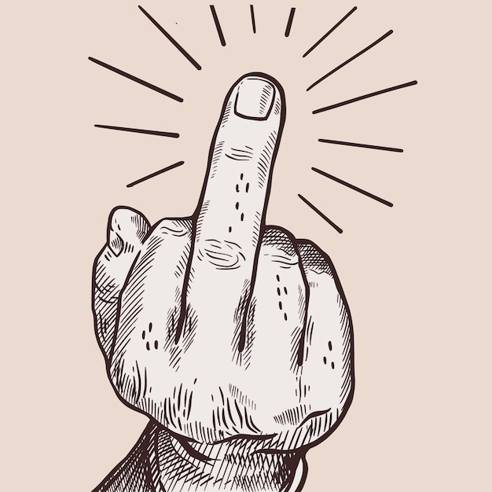

  

<h1 align="center">zap medium</h1>
<h3 align="center">remove medium articles from google searches. why not? the site is pretty junk.</h3>

## Installation

1. download the latest release zip file
2. unzip the file to a location on your computer
3. open google chrome (or any chromium based browser) and go to chrome://extensions/
4. enable "developer mode" in the top right corner
5. click "load unpacked" and select the unzipped extension folder
6. the Linkboard extension should now appear in your Chrome toolbar
